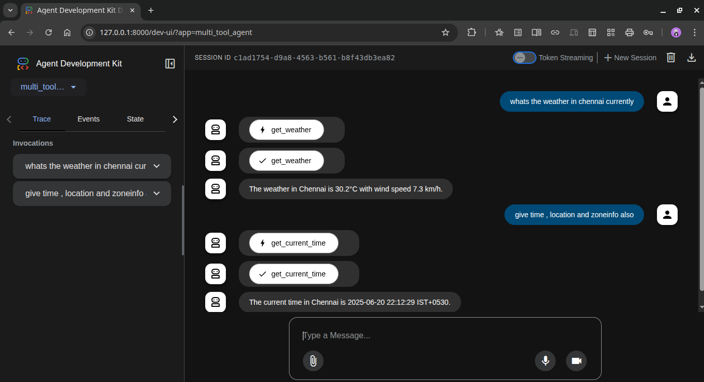

# Agent_Development_Kit
## To Run agent
`adk run multi_tool_agent` (inside parent_folder)
Or can access UI using `adk web`

# Response
## using terminal(adk run multi_tool_agent)

## using dev UI (adk web)

# Open-Meteo API
- The get_weather function in agent.py is now updated to retrieve weather data for any location using the Open-Meteo API. 
- It performs geocoding to get latitude and longitude for the city, then fetches the current weather.
- We can now use the agent to get weather information for any city, not just New York.